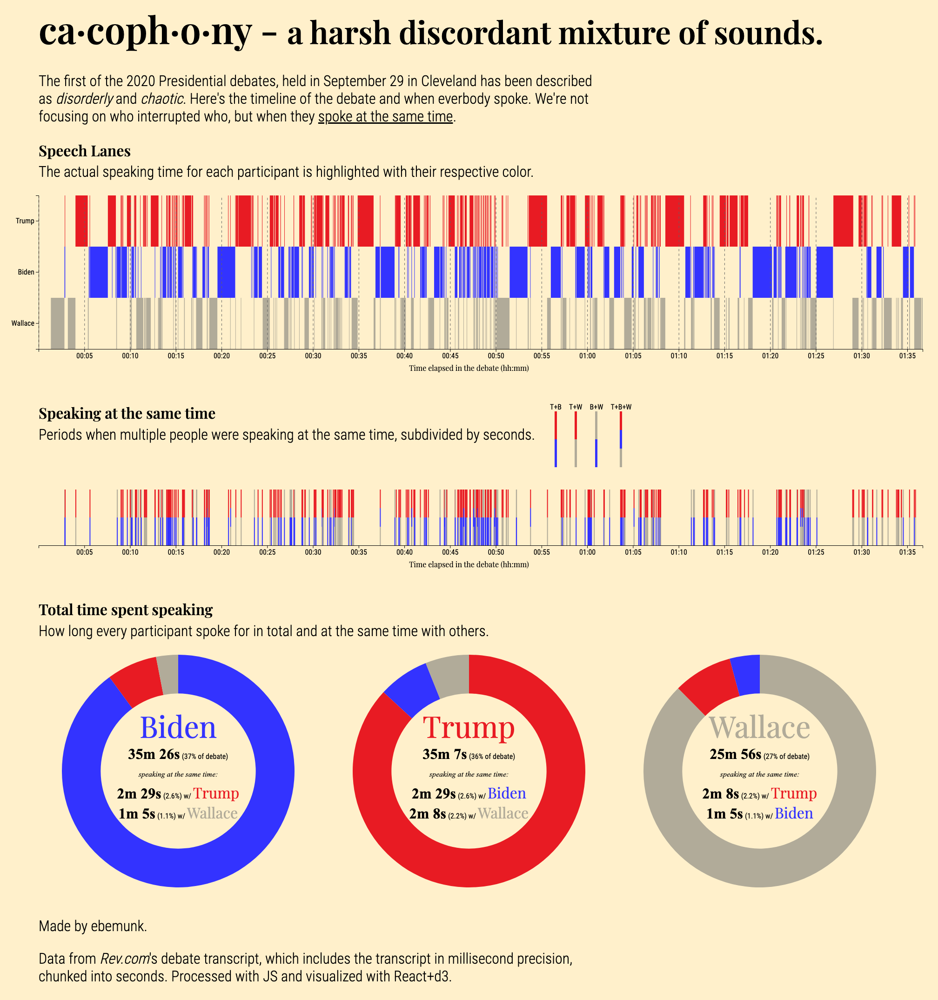
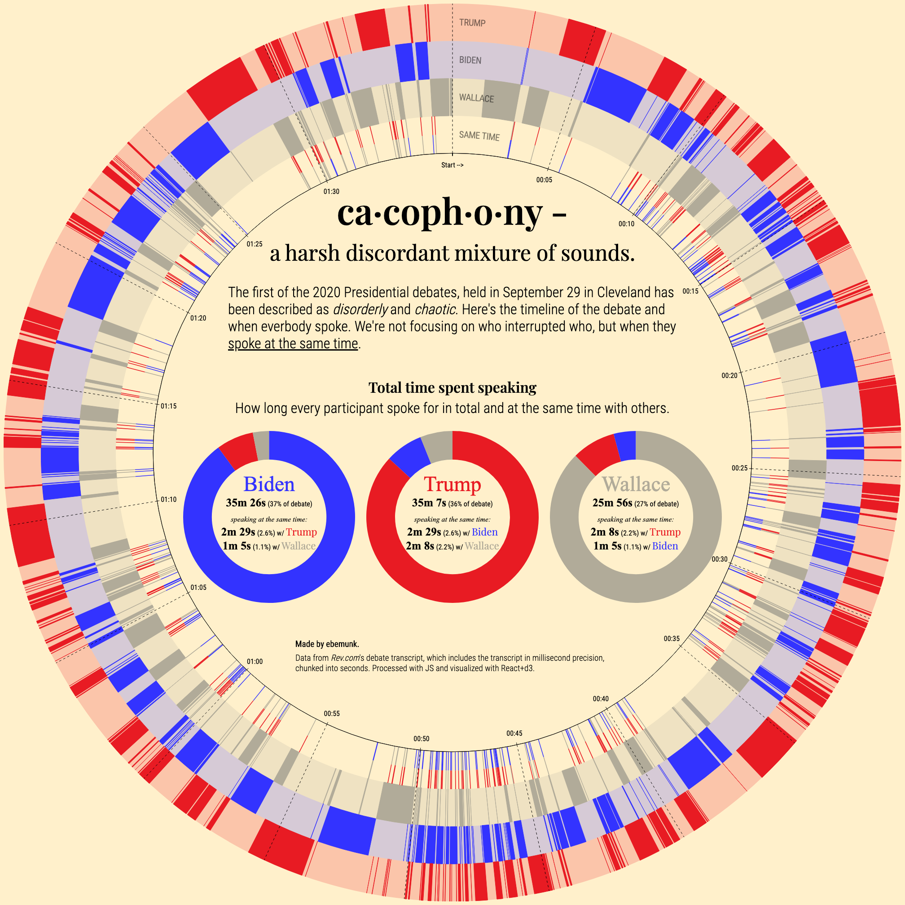

+++
date = "2020-10-08"
title = "ca·coph·o·ny - a harsh discordant mixture of sounds."
tags = ["data visualization", "quickviz"]
image = "img/cacophony.png"
related = ["2020-07-25-gutenberg-colors/index.md", "2019-01-05-plane-crashes.md"]
shortSummary = "2020 USA First Presidential Debate in perspective."
slug = "cacophony"
+++

I always get glimpses of cool ideas when I see great data, and after watching parts of the First Presidential Debate of 2020 I knew I had to do something with it. The transcript over at [Rev.com](https://www.rev.com/blog/transcripts/donald-trump-joe-biden-1st-presidential-debate-transcript-2020) contains incredibly detailed and millisecond timestamped data.

Hearing about how chaotic the debate went (and witnessing it after digging into the data), I wanted to look at how often people spoke over each other.

Click on the graphics to see it in full size.

As I was making the pie charts, I thought why not try a polar version - maybe it'll make for better visual interest.

Interested in prints of these graphics? I have a few copies printed on beautiful art paper. Reach out on twitter.

