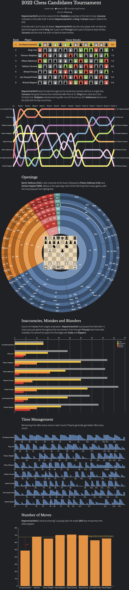

+++
publishDate = "2022-07-04"
title = "2022 Chess Candidates Tournament Recap"
slug = "candidates-2022"
tags = ["data visualization", "quickviz", "chess"]
image = "img/candidates2022.png"
shortSummary = "Recap of the 2022 Chess Candidates Tournament"
related = ["2016-02-27-visual-look-chess/index.md", "2018-12-29-chess-part2.md"]
+++

I wanted to do a quick recap of the [2022 Chess Candidates Tournament](https://en.wikipedia.org/wiki/Candidates_Tournament_2022) that saw Ian Nepomniachtchi emerge as the challenger for the second time. There were some good findings in there!

Click on the graphic to see it in full size.

